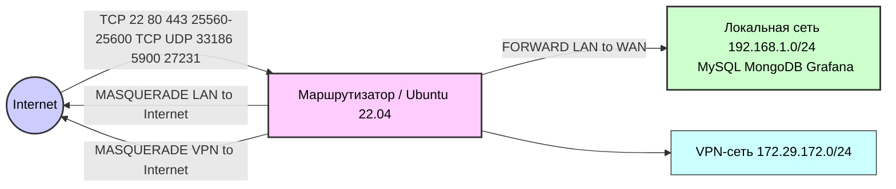

# Настройка iptables на маршрутизаторе

Маршрутизатор использует **Ubuntu Server 22.04** с Linux-кернелом соответствующей ветки. Вся внутренняя сеть — это IPv4 (подсеть `192.168.1.0/24` на интерфейсе `eno3`), а внешнее соединение идёт по интерфейсу `eno1` (WAN). Функционирует также VPN-интерфейс `amn0` (сеть `172.29.172.0/24`). IPv6 полностью отключено (в целях безопасности).  

## Используемые методы защиты

**Настройки sysctl и ядра.**  
Включено перенаправление IPv4 (`net.ipv4.ip_forward=1`) для работы в режиме маршрутизатора.  
Для защиты от SYN-флудов включены **TCP SYN Cookies** (`tcp_syncookies=1`), которые позволяют продолжать обслуживание легитимных TCP-потоков при перегрузке SYN-очереди.  
Параметры `tcp_max_syn_backlog` и `somaxconn` увеличены, чтобы расширить очередь полусоединений.  
Включён `rp_filter=1` (**Reverse Path Filter**) на всех интерфейсах для анти-спуфинга: ядро проверяет, что входящий пакет мог бы выйти по тому же интерфейсу к своему источнику.  
Время жизни соединений в таблице **conntrack** увеличено, чтобы снизить риск насыщения таблицы.

**Отключение IPv6.**  
Через `sysctl` отключена поддержка IPv6 (`net.ipv6.conf.all.disable_ipv6=1`, `net.ipv6.conf.default.disable_ipv6=1`).  
В `ip6tables` добавлено блокирование всех пакетов (`DROP` по умолчанию), чтобы исключить трафик IPv6.

**Анти-спуфинг и защита от аномалий.**  
Заблокированы входящие пакеты с приватными, зарезервированными и недопустимыми адресами (bogon-адреса).  
Отбрасываются фрагментированные пакеты, нестандартные флаги TCP, а также пакеты с подозрительными комбинациями флагов (XMAS, NULL, FIN-only).

**Логирование с ограничением.**  
Включено логирование подозрительных пакетов с помощью цели `LOG`, но с лимитом скорости, чтобы предотвратить переполнение логов (например, при DDoS-атаках).

**DROP по умолчанию.**  
Для всех цепочек `INPUT` и `FORWARD` действует политика `DROP`, и разрешается только явно указанный трафик.

**Ограничения по соединениям и pps.**  
Для публичных сервисов (SSH, HTTP/HTTPS, VPN, Minecraft, VNC и др.) установлены лимиты на количество одновременных подключений (`connlimit`) и скорость пакетов (`hashlimit`).  
Это предотвращает злоупотребления и снижает вероятность перегрузки.

**NAT и маршрутизация.**  
Включён маскарадинг (`MASQUERADE`) для выхода LAN и VPN в интернет.  
Таблица `FORWARD` настроена так, чтобы LAN и VPN могли выходить в интернет, но при этом VPN-клиенты изолированы от локальной сети.

**Изоляция VPN.**  
VPN-пользователи не могут напрямую подключаться к маршрутизатору или устройствам в LAN, если это не разрешено явно правилами.


## Архитектура сети

- **Интерфейсы**: WAN-интерфейс `eno1` соединён с Интернетом, LAN-интерфейс `eno3` — с локальной сетью 192.168.1.0/24. На маршрутизаторе также есть VPN-интерфейс `amn0` для клиентов VPN (сеть 172.29.172.0/24).  
- **Маршрутизация**: Маршрутизатор выполняет функции маршрутизатора/NAT: весь исходящий трафик из LAN в WAN маскарадуется (SNAT). Возвращённый ответный трафик попадает обратно благодаря правилам ESTABLISHED. Трафик из LAN может обращаться как к Интернету, так и к локальным сервисам напрямую (в пределах подсети).  
- **Защита WAN**: На границе с Интернетом включён фаервол (iptables) со строгими правилами (см. выше). Из Интернета к маршрутизатору открыты лишь указанные порты (22,80,443,25560-25600,33186,5900,27231) и протоколы. Все прочие входящие соединения блокируются по умолчанию.  
- **VPN и LAN**: Клиенты VPN фактически находятся «за» маршрутизатором: их трафик NAT’ится в Интернет аналогично LAN. Однако VPN-клиенты не видят локальную сеть — она для них «защищена» (из соображений безопасности). Локальные устройства напрямую общаются друг с другом (между собой и с локальными сервисами) без дополнительной фильтрации.  




## Таблица открытых портов

| Протокол | Порт(ы)        | Сервис         | Ограничение подключений           | Ограничение (pps) |
|----------|----------------|----------------|-----------------------------------|-------------------|
| TCP      | 22             | SSH            | 5/min (новых) per IP              | 20/s             |
| TCP      | 80, 443        | HTTP/HTTPS     | 30/s (новых) per IP; 200 conn/IP  | 80/s             |
| TCP      | 25560–25600    | Minecraft (TCP)| 10/s (новых) per IP               | 50/s             |
| UDP      | 25560–25600    | Minecraft (UDP)| 20/s (новых) per IP               | 150/s            |
| UDP      | 33186          | VPN (Amnezia)  | –                                 | 200/s            |
| TCP      | 5900           | VNC            | 11/min (новых) per IP; 5 conn/IP  | 30/s             |
| TCP      | 27231          | Nginx          | 30/s (новых) per IP               | 50/s             |

```
