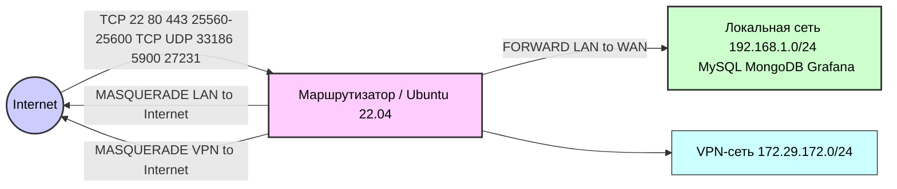

# Настройка iptables на маршрутизаторе

Маршрутизатор использует **Ubuntu Server 22.04** с Linux-кернелом соответствующей ветки. Вся внутренняя сеть — это IPv4 (подсеть `192.168.1.0/24` на интерфейсе `eno3`), а внешнее соединение идёт по интерфейсу `eno1` (WAN). Функционирует также VPN-интерфейс `amn0` (сеть `172.29.172.0/24`). IPv6 полностью отключено (в целях безопасности).  

## Используемые методы защиты

- :contentReference[oaicite:0]{index=0}:contentReference[oaicite:1]{index=1}**Настройки sysctl и ядра**. Включено перенаправление IPv4 (`net.ipv4.ip_forward=1`) для работы в режиме маршрутизатора. Для защиты от SYN-флудов включены TCP SYN Cookies (`tcp_syncookies=1`), которые позволяют продолжать обслуживание легитимных TCP-потоков при перегрузке SYN-очереди:contentReference[oaicite:2]{index=2}. Параметры `tcp_max_syn_backlog` и `somaxconn` увеличены, чтобы увеличить очередь полусоединений. Включён `rp_filter=1` (Reverse Path Filter) на всех интерфейсах для анти-спуфинга: ядро проверяет, что входящий пакет мог бы выйти по тому же интерфейсу к своему источнику:contentReference[oaicite:3]{index=3}. Время жизни conntrack (nf_conntrack) увеличено, чтобы уменьшить насыщение таблицы соединений.  

- **Политика по умолчанию DROP**. Все цепочки (INPUT, FORWARD) по умолчанию устанавливаются в `DROP`. Это означает, что без явного разрешения трафик блокируется. Такое «белое списочное» поведение является базовой практикой сетевой безопасности.

- **Сброс старых правил**. Перед установкой новых правил все предыдущие правила и цепочки очищаются (`iptables -F`, `-X`, `-t nat -F` и т.д.), чтобы избежать конфликтов. После этого политики IPv6 устанавливаются в `DROP` (и `ip6tables` полностью очищен), окончательно блокируя IPv6-трафик.

- **Логирование с лимитом**. Создана вспомогательная цепочка `LOG_DROP`, которая записывает в логи пакеты и сразу их дропает. При этом к логированию применяется модуль `limit` (максимум 2 лога в минуту с «взрывом» до 5), чтобы при атаке логи не забивались полностью. Это позволяет отслеживать аномалии (отмечаются префиксом `FW-DROP:`) без дестабилизации.

- **Отброс недопустимых состояний**. В INPUT сразу дропаются пакеты с состоянием `INVALID` (ошибочные или прерванные соединения), чтобы снизить нагрузку на систему отслеживания состояний (conntrack).

- :contentReference[oaicite:4]{index=4}:contentReference[oaicite:5]{index=5}**Фрагменты и «странные» TCP-пакеты**. Фрагментированные IPv4-пакеты (`-f`) сбрасываются. Хотя фрагментация — обычная функция IPv4, многие эксперты считают, что фрагментированные пакеты могут использоваться атакующими для обхода фильтров. Поэтому все фрагменты отбрасываются (требуя от точки отправки фрагментации самостоятельно). Также сбрасываются TCP-пакеты с некорректными наборами флагов: NULL (без флагов) и XMAS (все флаги). Такие пакеты часто используются при сканировании сети (NULL/XMAS-сканы):contentReference[oaicite:6]{index=6}. Дроп этих аномальных пакетов препятствует информационному сбору об ОС/службах по реакциям на нештатные пакеты.

- **Антибокон (Bogon filtering)**. На интерфейсе WAN блокируются *все* пакеты, приходящие с адресов из приватных или зарезервированных диапазонов: RFC1918 (10.0.0.0/8, 172.16.0.0/12, 192.168.0.0/16), link-local (169.254.0.0/16), CGN (100.64.0.0/10), multicast и пр. Такие адреса не должны появляться из Интернета, и их фильтрация предотвращает спуфинг внутренних адресов и «нереальный» трафик:contentReference[oaicite:7]{index=7}. (Отдельно разрешён только loopback-интерфейс `lo`, он полностью доверенный.)  

- **Разрешение loopback**. Весь трафик с `lo` (127.0.0.1) всегда разрешён (программа маршрутизатора может слушать локальные сервисы, их нельзя блокировать).

- **ESTABLISHED/RELATED**. Все пакеты, относящиеся к уже установленным соединениям, пропускаются (`-m conntrack --ctstate ESTABLISHED,RELATED -j ACCEPT`). Это стандартная практика: она позволяет «прозрачно» возвращаться ответному трафику для любых исходящих сессий и разбирать многопортовый протокол FTP и др.

- **NAT и маршрутизация**. На WAN-интерфейсе включён MASQUERADE для исходящего трафика локалки: пакеты LAN (`192.168.1.0/24`) подменяются публичным адресом маршрутизатора (SNAT), чтобы вернуть их в интернет. Разрешён форвардинг LAN→WAN (исходящий интернет-трафик локальных клиентов) и ответный WAN→LAN, соединениям в состоянии ESTABLISHED/RELATED. Таким образом локальная сеть может инициировать любые подключения в Интернет, а ответы вернутся по правилам коннект-трекера.  

- **Защита SSH (TCP 22)**. Доступ к SSH ограничен. С WAN порог вхождения установлен через модуль `recent`: не более **5 новых** соединений в минуту с одного источника, иначе пакеты дропаются. Также используется `hashlimit` на флаг SYN: не более **20 SYN в секунду** (с пиковой «очередью» 40) с одного IP. Это существенно затрудняет грубый подбор паролей и SYN-флуды на SSH:contentReference[oaicite:8]{index=8}. При этом из локальной сети `192.168.1.0/24` (LAN) SSH разрешён без ограничений как доверенный.  

- **Защита HTTP/HTTPS (TCP 80, 443)**. Входящие соединения на веб-сервер лимитируются: на IP-адрес разрешается не более **30 новых подключений в секунду** (после этого они дропаются), и не более **200 одновременных соединений**. Для SYN-пакетов введён `hashlimit` **80/s** (с пиковой 160). Такой контроль предотвращает DDoS-атаки на web: ограничивая скорость новых сессий и количество коннектов, аномальный трафик либо ложится в очередь, либо блокируется, не позволяя сломать сервер. Обычные клиенты (даже при переходе по множеству ссылок) редко превышают эти пределы.

- **Защита Minecraft-сервера (TCP/UDP 25560–25600)**. Для диапазона портов Minecraft (TCP и UDP) тоже введены лимиты. По TCP — не более **10 новых** соединений в секунду от одного IP, и **50 SYN/s** (hashlimit). По UDP — до **20 новых** «соединений» в секунду и **50 pps**. Остальное дропается. Это защищает от массовых запросов/сканирования Minecraft-сервисов и ограничивает возможные UDP-флуды.

- **VPN (UDP 33186)**. UDP-порт VPN (Amnezia) открыт. На него применяется `hashlimit` **200 пакетов/сек** (с пиком 400) на IP: это примерно предел, который роутер может выдержать. Если атакуют UDP-потоком, трафик сверх этой скорости сбрасывается. Это помогает защититься от UDP-флудов на VPN-сервер. Входящие VPN-запросы из LAN разрешены без ограничения (клиенты в локалке могут подключаться к VPN-серверу).

- **VNC (TCP 5900)**. Порт VNC доступен из WAN, но также жёстко ограничен: `recent` ограничивает **11 новых соединений в минуту** на IP, и `connlimit` не более **5 одновременных** подключений. На флаге SYN поставлен лимит **30/s**. Таким образом производится защита от перебора паролей и DoS-пакетов.

- **Nginx (TCP 27231)**. Пользовательский сервис на нестандартном порту 27231 под аналогичными ограничениями: **30/s (новых соединений)** и **50/s (SYN-пакетов)**. После прохождения этих лимитов трафик дропается или ставится в очередь.

- **Shadowsocks (TCP/UDP 8388)**. Этот локальный прокси (ss-server) слушает порт 8388, но только на LAN. Правила разрешают доступ на этот порт только из подсети `192.168.1.0/24` и из localhost. Любые запросы на 8388 с интерфейса WAN немедленно дропаются. Таким образом сервис доступен внутри сети, но не из Интернета.

- **DNS/NTP (клиент)**. Маршрутизатор выступает в роли клиента DNS и NTP. Исходящие DNS-запросы на порт 53 разрешены только к фиксированным публичным DNS-серверам (1.1.1.1, 8.8.8.8 и т.д.). Входящие ответы (ESTABLISHED) пропускаются. Аналогично UDP-запросы NTP (port 123) разрешаются только к указанным серверам времени. В результате роутер не отвечает на сторонние DNS/NTP-запросы (их трафик дропается), а посылает запросы только к «одобренным» серверам.

- **Локальные сервисы (только LAN)**. Некоторые сервисы доступны только внутри локалки и из loopback: SSDP (UDP 1900), mDNS (5353) и DHCP (в режиме DHCP-сервера). Они принимают пакеты только от `192.168.1.0/24`. Сетевые службы базы данных и приложений (MySQL 3306, MongoDB 27017, Grafana 3000) также доступны лишь из LAN или localhost. На WAN-порт 11211 (memcached) доступ вообще запрещён (DROP), чтобы не было известных уязвимостей в memcached. 

- **ICMP (пинг)**. ICMP-пакеты из локальной сети разрешены с высокой скоростью (до 70 пps, burst 140) — это облегчает диагностику внутри сети. Из WAN ICMP сильно ограничен (только 3 пинг/с, burst 6); это предотвращает ping-флуды и широковещательные ICMP-атаки извне.    

- **Изоляция VPN-клиентов**. Для сетки VPN (172.29.172.0/24, интерфейс `amn0`) включено NAT (MASQUERADE) в интернет, и разрешён выход в WAN. Однако VPN-клиенты **не имеют доступа** к локальным подсетям или самому роутеру: пакеты из VPN в адреса из `10.0.0.0/8`, `192.168.0.0/16`, `127.0.0.0/8` и к публичному IP маршрутизатора блокируются. Это обеспечивает безопасность: VPN-клиентам виден только Интернет, а не локальная сеть и сам роутер.  

## Архитектура сети

- **Интерфейсы**: WAN-интерфейс `eno1` соединён с Интернетом, LAN-интерфейс `eno3` — с локальной сетью 192.168.1.0/24. На маршрутизаторе также есть VPN-интерфейс `amn0` для клиентов VPN (сеть 172.29.172.0/24).  
- **Маршрутизация**: Маршрутизатор выполняет функции маршрутизатора/NAT: весь исходящий трафик из LAN в WAN маскарадуется (SNAT). Возвращённый ответный трафик попадает обратно благодаря правилам ESTABLISHED. Трафик из LAN может обращаться как к Интернету, так и к локальным сервисам напрямую (в пределах подсети).  
- **Защита WAN**: На границе с Интернетом включён фаервол (iptables) со строгими правилами (см. выше). Из Интернета к маршрутизатору открыты лишь указанные порты (22,80,443,25560-25600,33186,5900,27231) и протоколы. Все прочие входящие соединения блокируются по умолчанию.  
- **VPN и LAN**: Клиенты VPN фактически находятся «за» маршрутизатором: их трафик NAT’ится в Интернет аналогично LAN. Однако VPN-клиенты не видят локальную сеть — она для них «защищена» (из соображений безопасности). Локальные устройства напрямую общаются друг с другом (между собой и с локальными сервисами) без дополнительной фильтрации.  




## Таблица открытых портов

| Протокол | Порт(ы)        | Сервис         | Ограничение подключений           | Ограничение (pps) |
|----------|----------------|----------------|-----------------------------------|-------------------|
| TCP      | 22             | SSH            | 5/min (новых) per IP              | 20/s             |
| TCP      | 80, 443        | HTTP/HTTPS     | 30/s (новых) per IP; 200 conn/IP  | 80/s             |
| TCP      | 25560–25600    | Minecraft (TCP)| 10/s (новых) per IP               | 50/s             |
| UDP      | 25560–25600    | Minecraft (UDP)| 20/s (новых) per IP               | 150/s            |
| UDP      | 33186          | VPN (Amnezia)  | –                                 | 200/s            |
| TCP      | 5900           | VNC            | 11/min (новых) per IP; 5 conn/IP  | 30/s             |
| TCP      | 27231          | Nginx          | 30/s (новых) per IP               | 50/s             |

```
