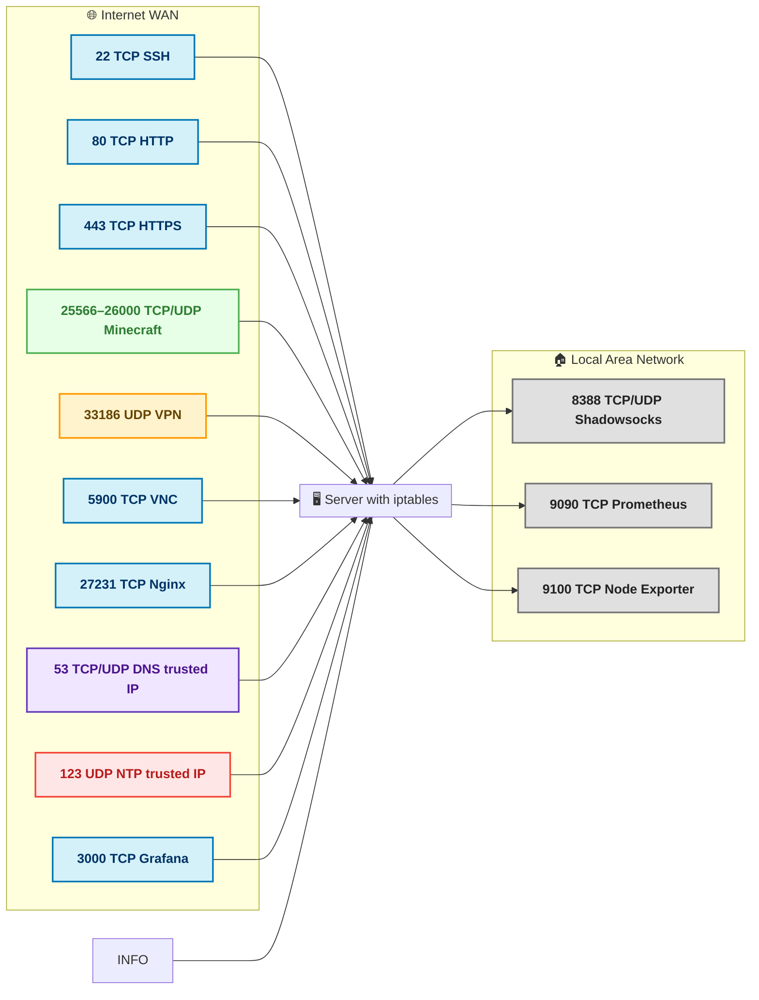

# 🛡️ Скрипт защиты сервера с iptables

## 📌 Введение

Этот скрипт — это **полный набор правил iptables**, который:
- Оставляет открытыми только **нужные порты**.
- Ограничивает скорость подключения и пакетов (**защита от DDoS**).
- Делит доступ между **WAN (интернет)** и **LAN (локальная сеть)**.
- Защищает от атак на уровне сети (SYN Flood, UDP Flood, ICMP Flood).
- Даёт возможность **мониторить** и **отлаживать** защиту.

---

## 📊 Таблица портов и защит

| Порт  | Протокол | Направление | Описание | Что сделал в правилах |
|-------|----------|-------------|----------|------------------------|
| **22** | TCP | WAN+LAN | SSH | Разрешил, но ограничил 30 соедин./сек и 200 SYN pps. Защита от перебора паролей и SYN Flood. |
| **80** | TCP | WAN+LAN | HTTP (nginx) | Разрешил, но с лимитом 50 соедин./сек и 500 SYN pps. |
| **443** | TCP | WAN+LAN | HTTPS (nginx) | Аналогично HTTP, но под HTTPS. |
| **25566–26000** | TCP/UDP | WAN+LAN | Minecraft | Открыл все игровые порты, лимит 30 соедин./сек и 500 pps. |
| **33186** | UDP | WAN+LAN | VPN | Разрешил, лимит 200 pps, защита от UDP Flood. |
| **5900** | TCP | WAN+LAN | VNC | Лимитировал до 10 соедин./сек и 100 pps, чтобы не заддосили. |
| **27231** | TCP | WAN+LAN | Nginx (неизвестный сервис) | Оставил открытым с лимитом 20 соедин./сек и 200 pps. |
| **8388** | TCP/UDP | **LAN only** | Shadowsocks | WAN-запрет, доступ только из LAN, чтобы не сканировали. |
| **53** | TCP/UDP | WAN (ограниченные IP) | DNS | Лимит 100 pps, только от доверенных IP. |
| **123** | UDP | WAN (ограниченные IP) | NTP | Лимит 50 pps, только от доверенных IP. |
| **3000** | TCP | WAN+LAN | Grafana | Лимит 10 соедин./сек и 100 pps. |
| **9090** | TCP | LAN only | Prometheus | Только LAN, без лимитов. |
| **9100** | TCP | LAN only | Node Exporter | Только LAN, без лимитов. |

---

## 🎨 Схема потоков и лимитов

🌍 **WAN (интернет)**  
━━━━━━━━━━━━━━━━━━━━━━━━━━━━━━━━━━━━━━━━━━━━━━━━━━━━━━━━━━━━━━━━━━━━━  
**TCP:** 22, 80, 443, 25566–30000, 5900, 27231, 3000  
**UDP:** 33186 (VPN)  
**TCP/UDP:** 53, 123 (только доверенные IP)  
Все — с лимитами на соединения и pps.  
━━━━━━━━━━━━━━━━━━━━━━━━━━━━━━━━━━━━━━━━━━━━━━━━━━━━━━━━━━━━━━━━━━━━━  
⬇  
🖥 **Сервер с iptables**  
⬆  
📡 **LAN (локальная сеть)**  
━━━━━━━━━━━━━━━━━━━━━━━━━━━━━━━━━━━━━━━━━━━━━━━━━━━━━━━━━━━━━━━━━━━━━  
Все нужные порты доступны почти без ограничений,  
включая 8388 (Shadowsocks), 9090 (Prometheus), 9100 (Node Exporter).  
━━━━━━━━━━━━━━━━━━━━━━━━━━━━━━━━━━━━━━━━━━━━━━━━━━━━━━━━━━━━━━━━━━━━━  

---

---

## 📜 Описание, что сделано на каждом порту

1. **SSH (22/TCP)** — разрешён с WAN и LAN, но есть лимит соединений в секунду, чтобы защитить от брутфорса.
2. **HTTP (80/TCP)** и **HTTPS (443/TCP)** — пропускаются из интернета, но с лимитами, чтобы веб-сервер не положили DDoS-ом.
3. **Minecraft (25566–26000 TCP/UDP)** — оставлены игровые порты, но с ограничением на pps и соединения.
4. **VPN (33186/UDP)** — доступен для WAN, но защищён от флуда.
5. **VNC (5900/TCP)** — ограничен, чтобы работал нормально, но был недоступен для массированной атаки.
6. **Nginx на 27231/TCP** — открыт, но тоже с лимитами.  
7. **Shadowsocks (8388/TCP/UDP)** — полностью закрыт с WAN, доступен только в LAN.
8. **DNS (53 TCP/UDP)** и **NTP (123 UDP)** — разрешены только от доверенных IP.
9. **Grafana (3000/TCP)** — открыт для WAN, но с маленькими лимитами.
10. **Prometheus (9090/TCP)** и **Node Exporter (9100/TCP)** — доступны только в LAN.

---

## 🌐 Общая логика фильтрации

```plaintext
🛬 Пакет приходит
       │
       ▼
1️⃣ Проверяем: порт и протокол разрешены?
       │
       ├─ ❌ Нет → DROP (отбрасываем сразу, без записи в conntrack)
       │
       └─ ✅ Да → Проверяем лимиты (pps / соединения в сек)
                   │
                   ├─ 🚫 Лимит превышен → DROP
                   │
                   └─ ✅ Всё ок → Пропускаем
```

